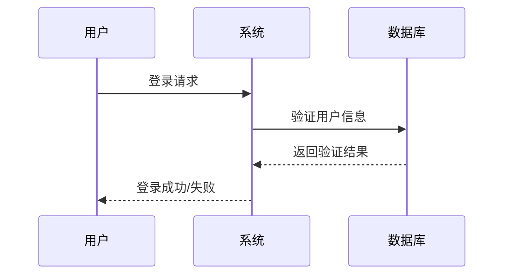
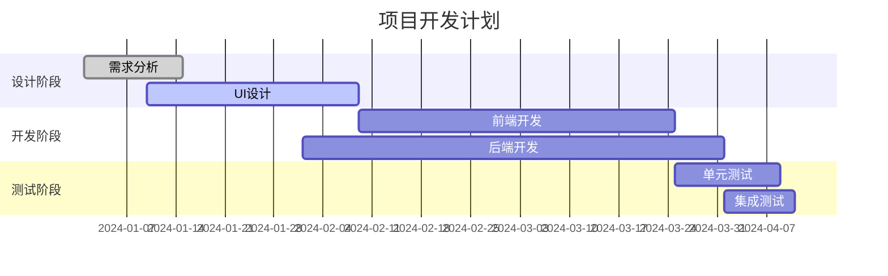
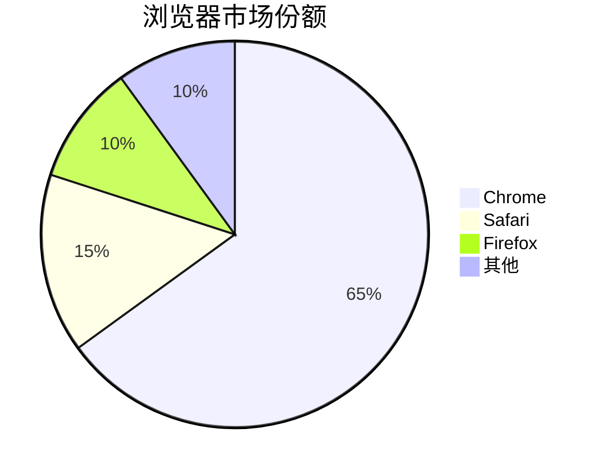
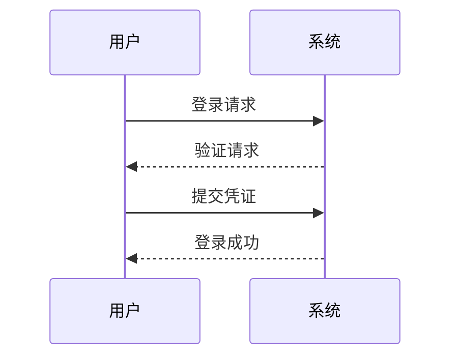

# 一级文本
## 二级文本
**加粗**

_空间和广泛的_   
~~空间和广泛的~~  
`import pandas`   
<mark>高亮文本</mark>  

**列表标记**  
- 第一项
- 第二项  

**有序列表**  
1. 第一项
2. 第二项    

- [ ] 未完成的任务
- [x] 已完成的任务  

> 区块引用

语法标识符  

```python{.line-numbers}
def calculate_area(radius):
    """计算圆的面积"""
    import math
    return math.pi * radius ** 2
# 使用函数
area = calculate_area(5)
print(f"圆的面积是: {area:.2f}")
```

```sql
SELECT u.name, u.email, COUNT(o.id) as order_count
FROM users u
LEFT JOIN orders o ON u.id = o.user_id
WHERE u.created_at >= '2024-01-01'
GROUP BY u.id, u.name, u.email
ORDER BY order_count DESC
LIMIT 10;
```

这是一个链接 [菜鸟教程](https://www.runoob.com)

## markdown表格
|  表头   | 表头  |
|  ----  | ----  |
| 单元格  | 单元格 |
| 单元格  | 单元格 |

| 左对齐 | 右对齐 | 居中对齐 |
| :-----| ----: | :----: |
| 单元格 | 单元格 | 单元格 |
| 单元格 | 单元格 | 单元格 |

数学公式
$$\int_{-\infty}^{\infty} e^{-x^2} dx = \sqrt{\pi}$$

$$
    \begin{pmatrix}
    a & b \\
    c & d
    \end{pmatrix}
    $$

图表绘制(可以用ai)  



甘特图

饼图


